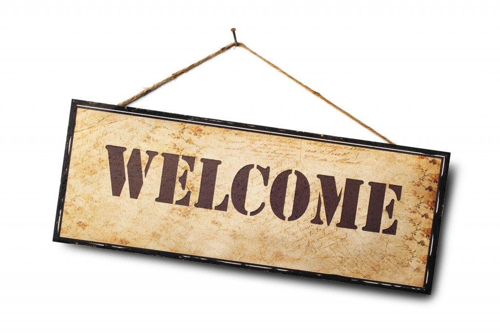

__Hello, I'm Jacky.  Welcome to  my website.  Here’s what you should know about me:__
 
 - I have been working as a statistical programmer in the pharmaceutical  industry (yeap, making drugs and saving lives), which gained me profound knowledge of statistics and proficient programing skills. 
 
 - I'm passionate about exploring data and solve the real world issues with the data science skills. 
 
 - I love to explain technical issues to non-tech audience. 
 
 - I'm also enthusiastic about public speaking and won a tall tale speech contest. (Data is not exactly tall tale but storytelling is an important skill for data scientist!)
 
 - Our (yeap, teamwork!) recent project on Kaggle competition has won a bronze medal (top 8% ). I'm pretty proud of it. 
 
 - I love to read , write, dance, and play ukulele sometimes.  

